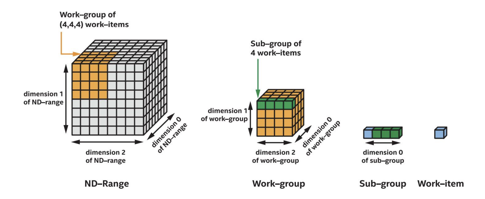

# sycl-tutorial

## SYCL

SYCL（发音为‘sickle’）代表着一个行业标准化的努力，包括支持 C++ 的数据并行编程。它被总结为“用于 OpenCL 的 C++ 单一源异构编程”。SYCL 标准，像 OpenCL* 一样，由 Khronos Group* 管理。

SYCL 是一个建立在 OpenCL 之上的跨平台抽象层。它使用 C++ 以“单一源”风格编写异构处理器的代码。这不仅对程序员有用，而且还赋予编译器分析和优化整个程序的能力，无论代码将在哪个设备上运行。

与 OpenCL 不同，SYCL 包括模板和 Lambda 函数，以实现高级应用软件与内核代码的优化加速的清晰编码。开发人员在比 OpenCL 更高的级别上进行编程，但始终可以通过与 OpenCL 以及 C/C++ 库的无缝集成访问低级别代码。

## Data Parallel C++

Data Parallel C++（DPC++）是 oneAPI 对 SYCL 编译器的实现。它利用现代 C++ 的生产力优势和熟悉的构造，并结合了 SYCL* 标准的数据并行性和异构编程。SYCL 是一种单一源语言，其中主机代码和异构加速器内核可以混合在同一个源文件中。SYCL 程序在主机计算机上调用，并将计算卸载到加速器上。程序员使用熟悉的 C++ 和库构造，增加了像用于工作定位的队列 `queue`、用于数据管理的缓冲区 `buffer` 和用于并行性的 `parallel_for` 等功能，以指导哪些部分的计算和数据应该被卸载。

DPC++ 程序增强了生产力。简单的事情应该简单地表达，减少冗余性和程序员负担。它们还通过让程序员控制程序执行并启用硬件特定功能来增强性能。这是一个快速发展的开放合作，为 SYCL* 标准提供反馈，并且是一个开源实现，旨在通过上游 LLVM 和 DPC++ 扩展成为核心 SYCL* 或 Khronos* 扩展。

## oneAPI 编程模型

### 平台模型

oneAPI 的平台模型基于 SYCL* 平台模型。它规定了一个主机控制一个或多个设备。主机是计算机，通常是一个基于 CPU 的系统，执行程序的主要部分，特别是应用范围和命令组范围。

主机协调和控制在设备上执行的计算工作。设备是加速器，是一种专门的组件，包含可以比系统中的 CPU 更高效地执行一部分操作的计算资源。每个设备包含一个或多个计算单元，可以并行执行多个操作。每个计算单元包含一个或多个处理元素，作为计算的单个引擎。

一个主机与一个或多个设备通信。每个设备可以包含一个或多个计算单元。每个计算单元可以包含一个或多个处理元素。

### 执行模型

执行模型基于 SYCL* 执行模型。它定义和规定了代码（称为内核）在设备上执行并与控制主机交互的方式。主机执行模型通过命令组协调主机和设备之间的执行和数据管理。命令组是一组命令，如内核调用和访问器，提交到队列进行执行。

访问器也是内存模型的一部分，它还会传达执行的顺序要求。采用执行模型的程序声明和实例化队列。队列可以由程序控制以顺序或无序方式执行。顺序执行是英特尔的扩展功能。

设备执行模型指定了在加速器上执行计算的方式。从小型一维数据到大型多维数据集的计算都分配在 ND 范围、工作组、子组（英特尔扩展）和工作项的层次结构中，这些都是在将工作提交到命令队列时指定的。

需要注意的是，实际的内核代码代表了一个工作项执行的工作。内核之外的代码控制执行的并行度；工作量的数量和分配由 ND 范围和工作组大小的规定控制。

以下图示了 ND 范围、工作组、子组和工作项之间的关系。总工作量由 ND 范围大小指定。工作的分组由工作组大小指定。示例显示了 X * Y * Z 的 ND 范围大小，X' * Y' * Z' 的工作组大小和 X' 的子组大小。因此，有 X * Y * Z 个工作项。有 (X * Y * Z) / (X' * Y' * Z') 个工作组和 (X * Y * Z) / X' 个子组。

ND-Range -> Work-group -> Sub-group -> Work-item


### 内存模型

oneAPI 的内存模型基于 SYCL* 的内存模型。它定义了主机和设备如何与内存交互。它协调主机和设备之间的内存分配和管理。内存模型是一个抽象概念，旨在跨不同可能的主机和设备配置进行泛化和适应。

在这个模型中，内存驻留在主机或设备上，并由声明内存对象来指定。有两种不同类型的内存对象，缓冲区 buffers 和图像 images。这些内存对象在主机和设备之间的交互是通过访问器实现的，访问器传达了所需访问位置（如主机或设备）和访问模式（如读取或写入）。

考虑一个情况，内存是通过传统的 malloc 调用在主机上分配的。一旦内存在主机上分配，就会创建一个缓冲区对象，这使得主机分配的内存可以传递给设备。缓冲区类传达了要传递到设备进行计算的类型和数量的项目。一旦在主机上创建了缓冲区，就通过访问器对象传达了在设备上允许的访问类型，该访问器对象指定了对缓冲区的访问类型。

## How to build

```bash
source /opt/intel/oneapi/setvars.sh
export CC=icx
export CXX=icpx

cd sycl-tutorial
mkdir build && cd build
cmake ..
make -j
```

### Reference:

1）Training: https://devcloud.intel.com/oneapi/get_started/baseTrainingModules/  
2) DPC++ API: https://intel.github.io/llvm-docs/doxygen/index.html  
